# Running in Кubernetes

## Using private Docker repository

To enable pulling from private Docker repository, read the following guide:
[Add ImagePullSecrets to a service account](https://kubernetes.io/docs/tasks/configure-pod-container/configure-service-account/#add-imagepullsecrets-to-a-service-account)

```bash
kubectl create secret docker-registry ut \
    --docker-server=nexus-dev.softwaregroup.com:5001 \
    --docker-username=... \
    --docker-password=...
kubectl patch serviceaccount default -p {"imagePullSecrets": [{"name": "ut"}]
```

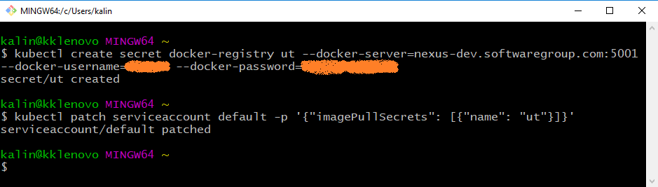

If you are running on Windows, make sure you run the commands in a bash shell,
otherwise you need to use double quotes and escape the ones in the JSON:

```txt
C:\>kubectl patch serviceaccount default -p "{\"imagePullSecrets\": [{\"name\": \"ut\"}]}"
```

There are alternative ways, you just need to ensure the next commands can access
the referenced repository.

## Running the installation

Use the kubectl to start the installation:

```bash
kubectl run -it --rm --port=8000 --restart=Never \
    --image=nexus-dev.softwaregroup.com:5001/ut/impl-agency-amd64 \
    impl-agency -- server install
```

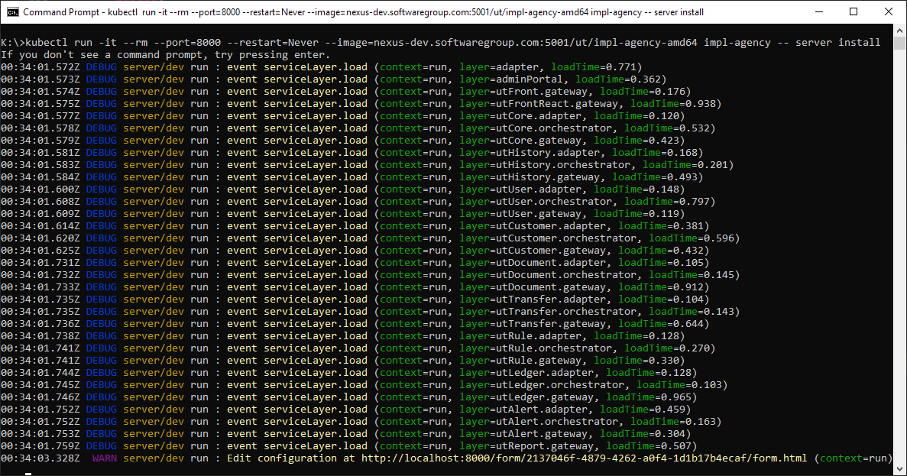

This will create a pod and output a URL, where the installation
can be configured. The easiest way to access the URL, is to
forward the pod port to localhost. This can be done by running this command
in a separate terminal:

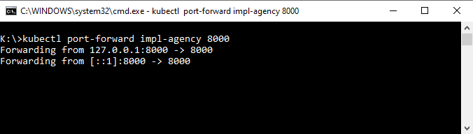

## Editing the configuration

Use a browser to edit the configuration:

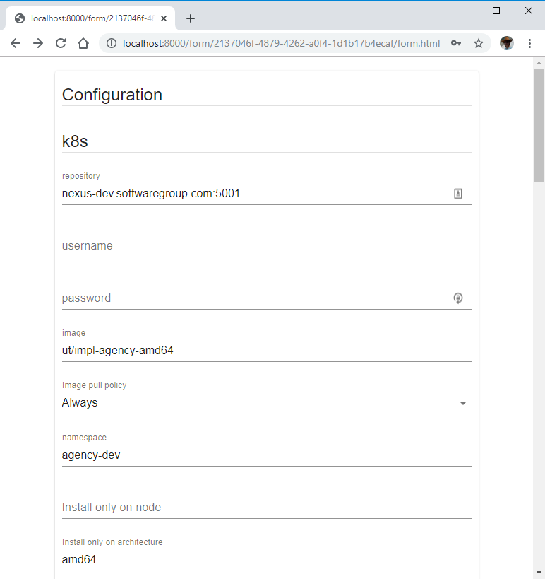

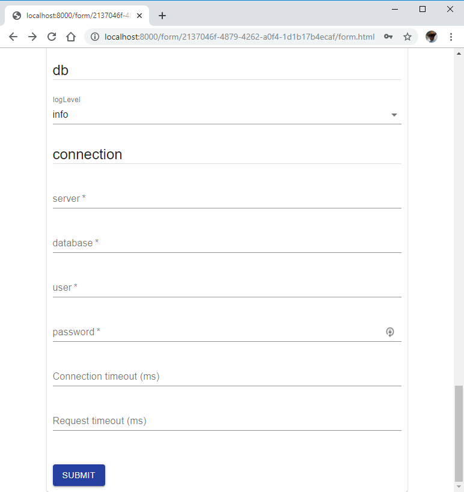

When ready, press the `submit` button

## Install the application in the cluster

Use the next screen to obtain the command for installing the
application in the cluster:

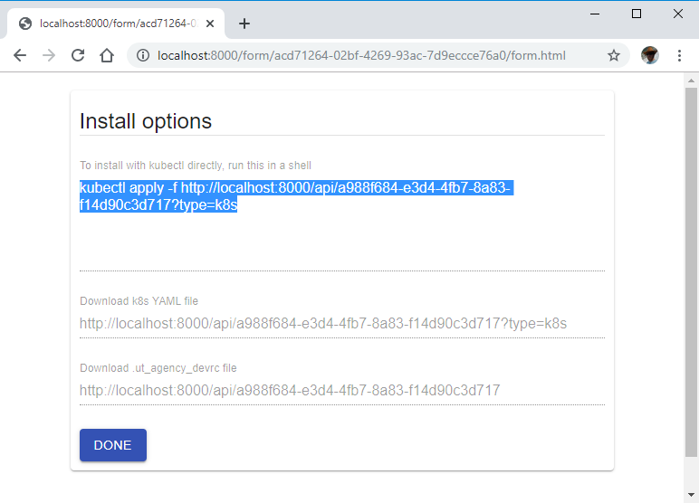

Use `kubectl` to install:

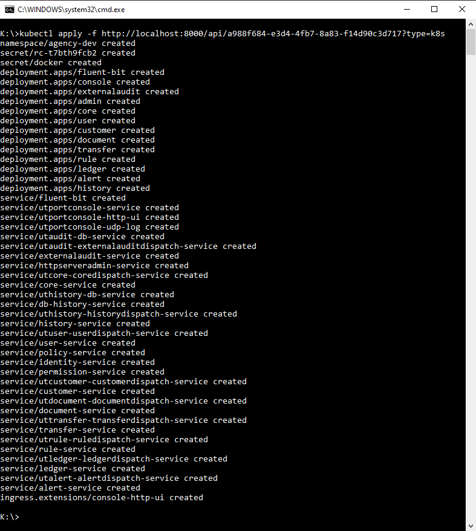

Finally press the `done` button to end the configuration
editing pod. The following screen will be shown:

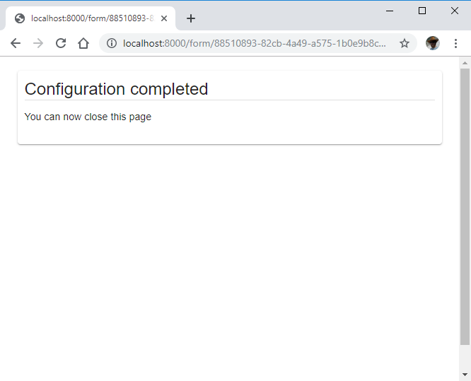

The pod will be deleted:

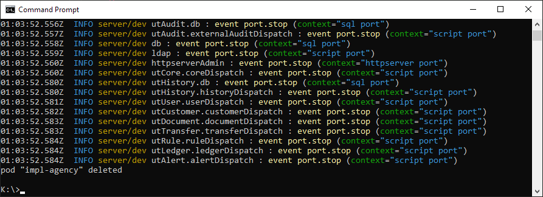

## Result

As result, a number of pods will be created:

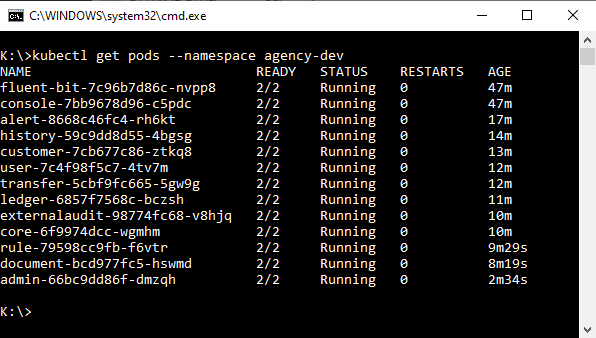

A console for observing logs from all the pods in real time
is also installed and can be accessed through ingress:

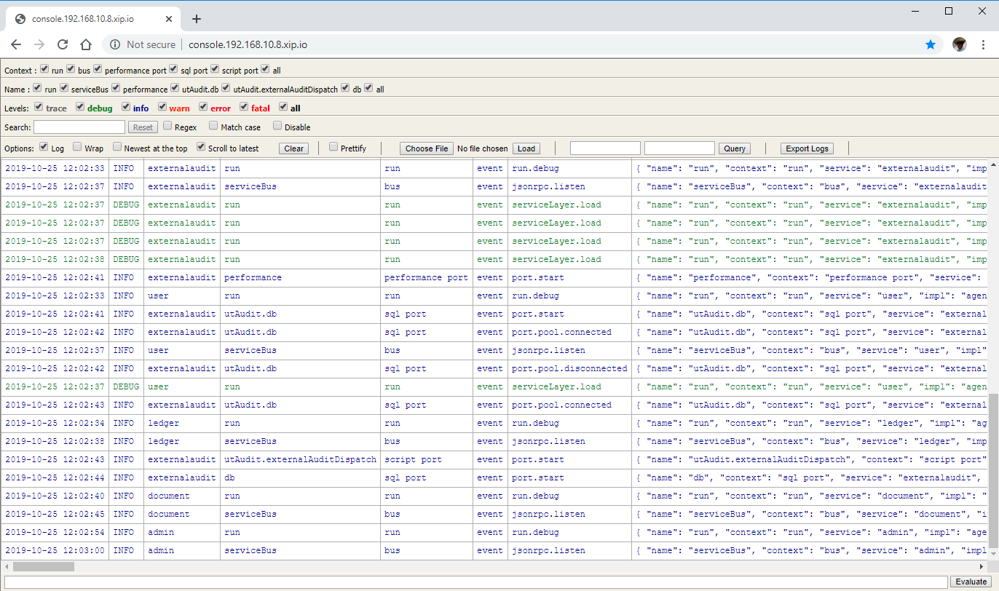

## Configuration

To configure the application to run in Kubernetes, there are
certain parameters that need to be defined. Some of them
are specific to Kubernetes, while others are related to
the application runtime/process structure.

### Kubernetes deployment parameters

The installation allows certain parameters related to Kubernetes to be configured.
It will read defaults from the standard configuration mechanisms (i.e. rc file,
command line parameters, environment variables) and then allow
the values to be edited in the web browser. The following example configuration file
shows the available parameters:

```yaml
#example rc file ut_standard_devrc
k8s:
  node: k3s-hp # limit deployment to specific node
  architecture: amd64 # limit deployment to specific architecture
  pull: Always # image pull policy
  repository: nexus-dev.softwaregroup.com:5001
  image: ut/impl-standard-amd64
  namespace: standard-dev # defaults to implementation-environment
  fluentbit: # turns on fluentbit deployment used to forward logs
    host: elasticsearch.local # host to which to forward the logs
    port: 9200 # port to which to forward the logs
```

### Grouping layers in microservices

As per [composable microservices](../../microservices.md) description, modules define
microservice layers. Microservices are created by combining these layers in separate
processes (or pods). For the application to run in the cluster, a set of
microservices must be defined in the application configuration as per the
following structure, which maps each layer to a microservice:

```yaml
run:
  layers:
    console: console
    utFront.gateway: microservice1
    module1.gateway: microservice1
    module2.gateway: microservice1
    utFrontReact.gateway: microservice1
    adapter: microservice2,microservice3
    module1.adapter: microservice2
    module1.orchestrator: microservice2
    module2.adapter: microservice2
    module2.orchestrator: microservice2
```

### General configuration

For install to function properly when being run as kubernetes pod,
some general configuration is needed too:

* disable udp logging
* enable console logging
* set edit server port

The corresponding application configuration, usually saved
as JSON in a file `server/install.json` is:

```yaml
console: true
run:
  edit:
    server:
      port: 8000
utLog:
    streams:
      udp: false
```
