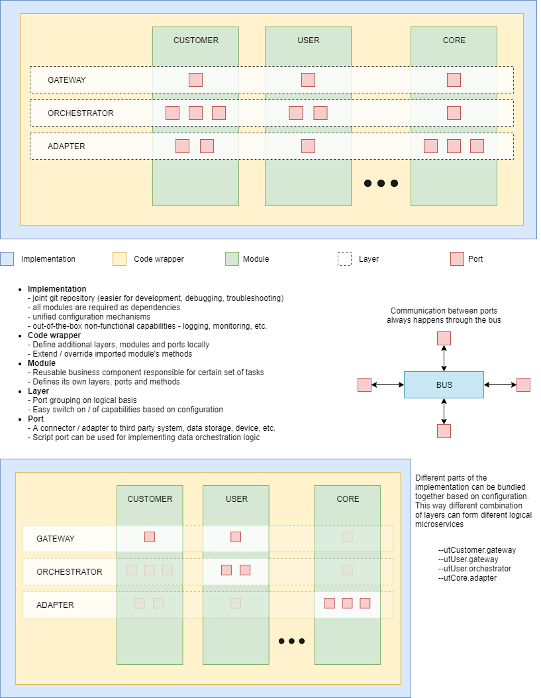

# Composable microservices

UT Framework allows modular approach towards microservices development.
This approach helps for addressing the various aspects of the development
by providing common approach to the aspects described below.
We can name this `Composable microservices` as they are composed
of modular elements

## Definitions

We will use the following definitions:

* `Microservice` - A buzzword, referring to the runtime aspect of a modular
  development of application server middleware, using service oriented
  architecture (SOA). In this framework, we are not targeting only
  server side middleware. The same principles can apply for a much bigger
  domain of software

* `Business logic` - the primary functionality of the system, which
  defines how it solves business's use cases

* `Data integrity logic` - part of the business logic, that ensures that
  data is persisted in an atomic and logically correct way.

* `Business process` / `workflow` - part of the business logic, that operates
  on top of the `data integrity logic` and coordinates it. Note that there is
  no strict boundary between the `business process` and the `data integrity logic`,
  but often the `data integrity logic` does not change between applications,
  while the `business process` is more varying.

* `Microservice platform` - the platform that is going to run the software.
  Although primary focus will be `server`, same concepts can be applied for
  other platforms:
  * `desktop` - Desktop application
  * `browser` - Browser base application
  * `mobile` - Mobile application

* `Microservice modular approach` - allow microservices to be created by combining
  functionality of several modules, while keeping maximum isolation between them

* `Microservice module` - this is a grouping of `microservice layers`, as an
  individual development unit, often focused on full implementation of closely
  related functionality. Each microservice module is usually developed in a
  separate code repository and all layers are released and versioned together.
  Examples are:
  * `loan module` - a module for handling a Loan lifecycle
  * `transfer module` - a module for handling electronic funds transfers

* `Microservice layer` - this is partial functionality of certain microservice,
  usually relating to some architectural layers (like database, front-end, etc.)
  or functional aspect(like transaction processing, reporting, etc.).

  Examples layers are:
  * `browser` - the functionality, that runs in the browser, usually related
  to providing the GUI

  * `gateway` - the part of functionality, relating to the API gateway.
    It includes functions relating to API documentation, validations,
    route handlers, etc. Usually it includes almost no `business logic`

  * `adapter` - the part of the functionality, that implements functions related
  directly to communicating with external systems, often handling network protocols.
  This often relates directly with the `Data integrity logic`. Examples include
  handling communication with SQL, HTTP, FTP, mail and other servers or devices.

  * `orchestrator` - the part of the functionality, that coordinates the work
  between adapters. This is often where the `business process` is implemented
  * `eft` - the part of the `business process` that handles funds transfers.
  This is a typical example of online transaction processing (OLTP).
  This is usually where high requirements for scalability, transactions per
  second (TPS), security and resilience are required, so it deserves a
  separate layer.

  NOTE: the primary goal of `microservice layers` is to group different
  kinds of `microservice handlers`, that usually run in one microservice.
  By grouping them, it is easier to run them together.

* `Microservice handlers` - this is a set of low level functions, usually
  grouped by their role, for example: validations, error definitions,
  database schema, etc. These handlers are often named in the form
  `name1.name2.name3`, to allow for name spacing between microservice modules.

### Graphical representation



## Logical structure

Following a common logical structure, allows combining the `microservice modules`,
`microservice layers` and `microservice handlers` in a flexible way,
so that different microservices may be created, depending on the need.
When combining these elements an important aspect is being able to
provide configuration and customization for each element, starting from
a simple enabling/disabling it, to passing more complex configuration.
Often parts of the configuration are specific to the running environment
(development, test, production, etc.). While ut-run can be used in different ways,
the following logical structure is its primary use case:

```js
// start definition of various handlers

// values param1, param2 will be taken from the module configuration,
// under a key named adapter1
function adapter1({utLog, utBus, utPort, utError, utMethod,
    config: {param1, param2}}) {

    // optionally create some closures to store private data
    let someMethod = utMethod('module2.entity1.action1');

    // return a class, which extends a base adapter (usually ut-port-*)
    // always pass all arguments, so each adapter has access to the same
    return class adapter1 extends require('ut-port-tcp')(...arguments) {

        // optionally override the constructor
        constructor({utLog, utBus, utPort, utError, utMethod, config}) {
            super(...arguments); // call super constructor with all arguments
            // init some fields
            this.field1 = {};
            this.field2 = 0;
        }

        // define getter, to override the base class defaults
        // final configuration will be a result of merging all defaults
        // in the class chain starting with the base class
        get defaults() {
            return {
                // add these as additional handlers
                imports: ['utModule1.handlers1', 'utModule1.handlers2'],
                idleSend: 60000, // generate idleSend event
                idleReceive: 130000, // generate idleSend event
                maxReceiveBuffer: 4096 // limit receive buffer
            };
        }

        // optionally override base class methods, do not forget to call super
        async start() {
            const result = await super.start(); // use await for better stack traces
            await someMethod(); // do some custom processing, using the closure
            return result;
        }
        stop() {
            // do custom processing
            return super.stop(); // no need of async/await, if we just return
        }

        // a set of event handlers, closely related to the adapter lifecycle
        handlers() {
            return {
                // use arrow function in case you need tho access the port with this
                // handle standard adapter events, no need to call super
                start: () => {},
                init: () => {},
                ready: () => {},
                stop: () => {},

                // optionally handle specific events for tcp port

                // event for when port was connected
                'connected.event.receive'() {},
                // event for when port was disconnected
                'disconnected.event.receive'() {},
                // event for port was sending no data for a while
                'idleSend.event.receive'(msg, $meta, context) {},
                // event for when port send queue is was empty for a while
                'drainSend.event.receive'(msg, $meta, context) {},

                // optionally handle method events, related to the protocol conversions
                // do not use arrow functions and avoid using this, to stay more
                // independent of the port and maybe move these methods
                // in a handlers lib, that is easier to unit test

                // before sending a request of type action1 to external system
                'action1.request.send'(msg, $meta) {},

                // after receiving a request of type action1 from external system
                'action1.request.receive'(msg, $meta) {},

                // before sending a response of type action1 to external system
                'action1.response.send'(msg, $meta) {},

                // after receiving a response of type action1 to external system
                'action1.response.receive'(msg, $meta) {}
            };
        }
    };
}

// define a set of handlers, to be imported in some adapter using imports: [utModule1.handlers1]
function handlers1({import:{
    module2Entity1Action1, // automatic method import based on name
    module2Error1 // automatic method import based on name
}}) {
    return {
        // use async function, for improved stack traces with await
        // and for less code, compared to chaining .then() calls
        async 'module1.entity1.action1'(msg, {forward}) {
            // call method, pass tracing data in $meta.forward
            let result = await module2Entity1Action1(msg, {forward});

            // throw predefined error, pass params
            if (result.amount <= 0) throw module2Error1({params: {amount: result.amount}});
            return msg;
        },
        'module1.entity1.action2'(msg, $meta) {}
    };
}

// override original or previously imported methods by name,
// call overriden methods with super
function handlers2() {
    return {
        'module1.entity1.action2'(msg, $meta) {
            // optional preprocessing
            let result = super['module1.entity1.action2'](params, $meta); // optional
            // optional postprocessing
        }
    }
}


// define handlers for creating custom errors
function error({utError}) {
    return {
        'module1.error1': utError.defineError('error1', 'module1', 'Error message1'),
        'module1.error2': utError.defineError('error2', 'module1', 'Error message2')
    }; // use utError to help define this structure
}
function sql() { // use 'sql' as function name, to define SQL server schemas.
    // Import using imports:['utModule1.sql'] in a ut-port-sql
    return {
        schema: [{
            path: path.join(__dirname, 'sql', 'schema'),
            linkSP: true
        }]
    };
};

// use 'sqlSeed' as function name, to define SQL server seeds.
// import using imports:['utModule1.sqlSeed'] in a ut-port-sql and put
// them after *.sql in the list
function sqlSeed() {
    return {
        schema: [{
            path: path.join(__dirname, 'sql', 'seed'),
            linkSP: true
        }]
    };
};

function sqlStandard({config}) {
    // check if the utModule.sqlStandard configuration exists to determine if
    // the seed should be executed
    return config && {
        schema: [{
            path: path.join(__dirname, 'sql', 'standard'),
            linkSP: true
        }]
    };
};

// use 'http' as function name, to define http handlers.
// import using imports:['utModule1.http'] or imports:[/\.http$/] in ut-port-httpserver
function http() {
    return {
        start() { // this handler will be invoked on http server start
            this.registerRequestHandler([{}]); // register some handlers
        }
    };
};

// use validations as function name, to namespace all validations
// import using imports:['utModule1.validation'] or imports:[/\.validation$/]
// in ut-port-httpserver
function validation() {
    return {
        'entity.action1': () => ({
            // description to show in the documentation
            description: 'Description of entity.action1',

            // validations for the method parameters
            params: joi.object.keys({}),

            // validations for the method result
            result: joi.object.keys({})
        })
    };
}

// group handlers as layers, layers as modules and modules as application
// The application function will receive some platform API for the
// platform named 'platform1'
function platform1(...platformApi) {
    // extend platform API with some customizations
    let customization = require('./customization')(...platformApi);

    return [ // return list of modules, that define all the microservices

        // return a module named utModule1, will prefix handlers with this name
        (implementationApi) => (function utModule1({param1, param2}) {
            // param1, param2 are values from then current configuration, under utModule1.*
            // the functions returned by layers will receive configuration
            // from utModule1 sub-keys corresponding to the layer name
            return {
                //  layer function will receive parameters param1, param2
                // with values from then current configuration, under utModule1.layer1.*
                layer1: ({param1, param2}) =>
                    [ // return array of handlers for this layer
                        adapter1, handlers1, handlers2, error
                    ],
                layer2: () => // define another layer
                    [
                        sql, sqlSeed, sqlStandard, http, validation
                    ]
            };
        }(...customization)), // pass the customization to the module

        // second microservice module
        (implementationApi) => (function({config: {param1, param2}}) {
            // return anonymous module (function without a name)
            // access param1, param2 keys in the current configuration root,
            // when there is no module name
        }(...customization)) // pass the customization to the module

        // pass path to a microservice module, so it can be hot reloaded
        // if run.hotReload=true in the configuration
        require.resolve('ut-module3'),

        // if array is passed the first element is the module to be loaded, the rest
        // elements of the array will be passed to the module function
        // can be hot reloaded if run.hotReload=true in the configuration
        [require.resolve('ut-module4'), ...customization],

        // if array is passed the first element can be an object,
        // with properties pkg and main, which hold paths to module
        // and module's package.json. This enables both hot reload
        // (if configured) and proper installation in Kubernetes
        [{
            main: require.resolve('ut-module5'),
            pkg: require.resolve('ut-module5/package.json')
         }, ...customization],

    ];
};

module.exports = platform1;
```

## Overriding methods

```js
function utModule1() {
    return {
        orchestrator: () => [
            function service({utMethod}) {
                return {
                    async 'service.entity.action'(params, $meta) {
                        // calls handler defined in the port
                        await super['service.entity.action'](params, $meta)
                    }
                };
            }
        ]
    };
};

function utModule2() {
    return {
        orchestrator: () => [
            function service({utMethod}) {
                return {
                    async 'service.entity.action'(params, $meta) {
                        // calls module1
                        await super['service.entity.action'](params, $meta)
                    }
                };
            }
        ]
    };
};

function utModule3() {
    const basePort = require('ut-port-script');
    return {
        orchestrator: () => [
            (...params) => class script extends basePort(...params) {
                get defaults() {
                    return {
                        namespace: ['service'],
                        // order of imports determines earlier modules as super to
                        // following modules
                        imports: ['utModule1.service', 'utModule2.service']
                    };
                }
                get handlers() {
                    return {
                        'service.entity.action': async function(params, $meta) {
                            return 'result';
                            // some ports have predefined handlers, which can
                            // also be called with super.methodName()
                            // for example ut-port-sql has all the linked stored
                            // procedures available
                        }
                    };
                }
            }
        ]
    };
};

module.exports = (...params) => [
    utModule1,
    utModule2,
    utModule3
];

```

## Physical structure

To achieve good modularity, the logical structure above can be spit in modules,
that are physically separate, have their own source repository, versioning, etc.

### Application structure

Most of the time, the application can be simply composed by bundling
modules (dependencies) together, using the same logical structure, but instead
the code is physically in some module. The example from the logical structure
becomes simply:

```js
module.exports = function platform1(...platformApi) {
    let customization = require('./customization')(...platformApi);

    return [
        require('ut-module1')(...customization),
        require('ut-module2')(...customization),
        require.resolve('ut-module3'),
        [require.resolve('ut-module4'), ...customization],
        [{
            main: require.resolve('ut-module5'),
            pkg: require.resolve('ut-module5/package.json')
         }, ...customization],
    ];
};
```

It is recommended to follow the same approach, even when some custom functionality
is needed in the application. This means adding an element in the returned array,
that resolves to a local file

```js
    require('./custom1')(...customization),
```

### module structure

A module can have the following filesystem structure:

```text
ut-module1
├── package.json
├── index.js
├── browser.js
├── errors.js
├── api
|   ├── script
|   |   └── index.js
|   └── sql
|       ├── schema
|       |   └── *.sql
|       ├── seed
|       |   └── *.sql
|       ├── standard
|       |   └── *.sql
|       ├── schema.js
|       ├── seed.js
|       └── standard.js
├── doc
|   └── *.md
├── test
|   ├── integration
|   |   └── test.module1.*.js
|   └── sql
|       ├── schema.js
|       └── schema
|           └── *.sql
├── ui
|   └── index.js
└── validations
    ├── index.js
    └── testValidations.js
```

Such module can export microservice layers using the
following pattern:

Modules can follow the following pattern, to export layers in
the following files:

* `/index.js` - this file defines the server side layers

```js
// name the function after the folder name, using camel case
module.exports = () => function utModule1() {
    return {
        adapter: () => [
            // export errors, as they can be returned by the DB queries
            require('./errors'),           // returns a function named 'error'

            // export MSSQL schemas
            require('./api/sql/schema'),   // returns a function named 'sql'
            require('./api/sql/seed'),     // returns a function named 'sqlSeed'
            require('./api/sql/standard'), // returns a function named 'sqlStandard'

            // export MSSQL schema for automated tests, if needed
            require('./test/sql/schema')   // returns a function named 'sqlTest'
        ],
        orchestrator: () => [
            // export errors, if they can be thrown from the orchestrator
            require('./errors'),           // returns a function named 'error'

            // export orchestration handlers
            require('./api/script'),       // returns a function named 'module1'

            // export dispatcher to DB
            require('ut-dispatch-db')(['module1'], ['utModule.module1']),
        ],
        gateway: () => [
            // export route handlers to be used at the gateway
            require('./http'),             // returns a function named 'http'

            // export method validations to be used at the gateway
            require('./validations')       // returns a function named 'validation'

            // export method validations to be used at the gateway,
            // during automated tests
            require('./validations/test')  // returns a function named 'testValidation'
        ]
    };
};
```

* `/browser.js` - this file defines the browser layers

* `/package.json` - make sure the `/index.js` and `/browser.js`
  are put in the following keys in `/package.json`, so that
  webpack can pick `/browser.js`:

```json
{
    "name": "ut-module1",
    "main": "index.js",
    "browser": "browser.js",
}
```

```js
// name the function after the folder name, using camel case
module.exports = () => function utModule1() {
    return {
        browser: () => [
            // export browser UI
            require('./ui')                // returns a function named 'ui'
        ],
    };
};
```

## Runtime structure

Deployment of microservices often require running of tens or hundreds of them across
a network. Developers often need to run substantial amount of these services
in an isolated environment, while they do changes to multiple microservices.
Trying to have the same runtime architecture while developing - i.e. running big
number of separate processes, leads to significant need of computing resources, which
can slow down the development and increase the cost. The framework allows during
developing, all microservices to be run as a single process or a much smaller number
of processes, which has great impact on reducing resource needs. This is often
good enough approach, for substantial part of the functionality.

The goal of the framework is to isolate the code from the different microservices,
even when they are running in a single process.

Even when deploying in a smaller organization, it may make sense to combine
some microservices in a single process. The framework allows this to be done easily,
by just providing through configuration what services to be run.

The same concepts are applicable even to layers such as the browser, where
the modularity can be achieved in exactly the same way. Currently browsers
have runtime structure equivalent of the single process described above.
This also makes a good use of the framework's capabilities to allow
flexible runtime structure. But if needed, the framework can also allow
app to be running in some browser equivalent of multiple processes,
for example several tabs, web workers, even different browsers on
different machines, with minimal changes to source code.
